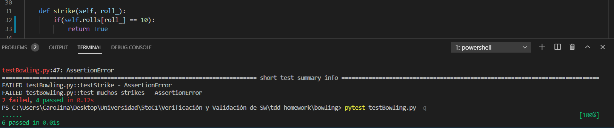

## Instrucciones para correr el proyecto.

En este caso se está utilizando Pytest por lo que para probar los casos de test
es necesario instalarlo en caso de no tenerlo ya, con el siguiente comando:

```bash
 pip install -U pytest
```

Luego para verificar que se instaló correctamente ejecutar el siguiente comando:

```bash
pytest --version
```

Para correr el programa se hace de la siguiente manera:

```bash
pytest testBowling.py
```
o para una ejecución mas detallada:
```bash
pytest -q testBowling.py 
```
 

## Ejemplo de un ciclo de TDD (Red/Green/Refactor) para alguna de las funciones implementadas

###  RED 
Una de las funciones implementadas que cumplían con el ciclo de TDD fue la llamada Strike que verificaba si la jugada representaba o no un strike.
```python
def testStrike():
      g=Game([])
      g.roll(10)
      assert g.strike(0)

```
En la siguiente imágen se muestra el error en el código por el cual no pasó el test por primera vez:

  

En este caso, se observa que el error se encuentra en la línea g.roll(0) y se comprueba que el código de la función roll estaba mal implementado al faltarle el atributo pins como parámetro:
```python

def roll(self):
        self.rolls.append(pins)
     

``` 
Se procede a corregir dicho error y la función roll quedó de la siguiente manera:

```python

def roll(self, pins):
        self.rolls.append(pins)
     

```
Luego de esto, se vuelve a ejecutar el comando para volver a correr el test:

```bash
pytest testBowling.py
```
En esta ocasión, el test vuelve a fallar debido a un error en el assert como muestra la siguiente imágen:

 

La causa de este error fue que en testStrike se estaba accediendo al primer roll, el de la posición 0, cuando debía ser la posición 1. Luego, procedemos a arreglar dicho error:
```python
def testStrike():
    g = Game([])
    g.roll(0)
    g.roll(10)
    assert g.strike(1)
```
Nuevamente volvemos a ejecutar pytest para verificar si pasan los test y éstos volvieron a fallar:  

 

El error que se obtuvo proviene de la mala implementación del método strike el cual era el siguiente:

```python

def strike(self, roll_):
        if(self.rolls[roll_] == 9):
            return True
     

```
Como se puede ver, el número de pins debía ser 10, no 9. Por lo tanto se procede a arreglar este error:

```python

def strike(self, roll_):
        if(self.rolls[roll_] == 10):
            return True
     

```
###  GREEN 
Una vez se vuelven a ejecutar el pytest y en este caso los test pasaron por lo que ahora se avanza a GREEN:

 



Luego se percibió que éste código se podía mejorar por lo que se realizó el siguiente refactor:

```python
def strike():
      return (self.rolls[roll_]==10)
```
A su vez, verificamos que este refactor pasara el test:

###  REFACTOR 
Después de continuar los tests, tratamos de obtener un coverage de un 100% pero obtuvimos un 97%:


Lo que se hizo ejecutando la siguiente línea:

```bash
coverage run -m pytest testBowling.py
```
En el caso de querer obtener más información con un reporte, ejecutar la siguiente línea:

```bash
coverage report -m
```

## Tipos de Test aplicados y ejemplos (remitirse a la teoría de la materia).  

<p>A medida que se fueron implementando nuevas funcionalidades para nuestro juego, primero se diseñaba el test de dicho método, por lo que para cubrir todas las posibilidades, en muchos casos, alcanzó con crear un solo test. En el caso de método más extensos, como por ejemplo scoreFinal, se realizaron más casos de tests para cubrir las posibilidades que se crearon debido al bucle, que además indirectamente volvía a testear los método spare y strike porque en scoreFinal se hacía uso de ellos. En otras palabras, lo que se hizo después de cada cambio, fuese en los test o en los métodos del juego, es volver a correr todos los tests para verificar que ese cambio no hubiera afectado a algunas de las funcionalidades ya creadas. </p>  

## Conclusiones:
### Dificultades y ventajas percibidas en cuanto a la metodología TDD y al proyecto en sí, críticas constructivas
<ul>
  <p>A la hora de realizar este trabajo se hizo uso de Github para poder tener un mejor control de versiones a medida que íbamos programando. Esto fue un desafío para nosotros ya que estábamos más acostumbrados a usar entornos como GitKraken por lo que a la hora de usar los comandos en la terminal pudimos ver qué estábamos haciendo en cada paso, porque teníamos que ejecutar un comando para cada cosa. Además, pudimos ver cómo crear ramas hacía el trabajo más ordenado ya que ninguno de los dos estaba acostumbrado a hacer esto. En cuanto a las dificultades presentadas con esta metodología, se tuvo un par de problemas a la hora de hacer los pull request que hicimos rápidamente y sin observar que se los realizamos a la rama del profesor.</p>
<p>Por otro lado, como adoptamos la metodología de pair programming (mediante videollamadas compartiendo pantalla), pudimos aprovechar los conocimientos de cada uno sobre un lenguaje en el cual ninguno tiene mucha experiencia y fuimos llevando a cabo ciclos de TDD.  En cuanto a la metodología TDD, las dificultades fueron que en varias ocasiones tuvimos que volver todo hacia atrás al darnos cuenta de que estábamos modificando en la rama master en vez de en una nueva rama, o que estábamos realizando cambios en otros métodos que no correspondian a la funcionalidad que queríamos crear en esa rama. Pero fuera de eso, consideramos que fue muy útil realizar TDD porque de esa manera nos comenzamos a acostumbrar a ser más ordenados a la hora de programar una nueva funcionalidad o hacer refactor en otras. Además, comenzar por los test nos ayudó a determinar más fácilmente cuál era la funcionalidad que esperábamos que hiciera nuestro código. 
</p>
